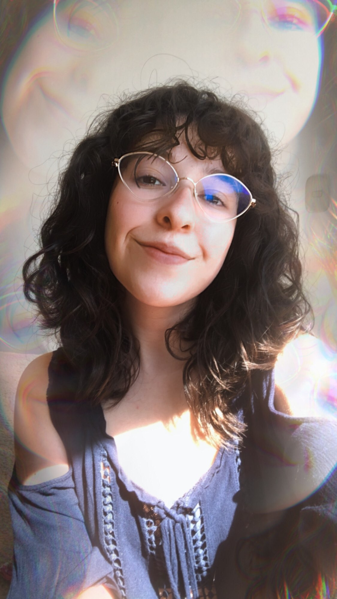
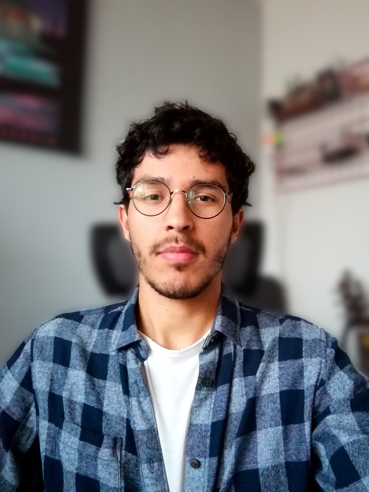

<link href="../assets/css/custom.css" rel="stylesheet" type="text/css">

## ¿Quiénes somos?
Voyager es un semillero de investigación con enfoques aeronáuticos y astronáuticos creado por un grupo de estudiantes de Ingeniería Aeroespacial de la Universidad de Antioquia en el año 2017, inicialmente, como un grupo de divulgación científica. Actualmente, dedicado al diseño y construcción de sistemas para vehículos aeroespaciales, tales como: sistemas de sensoramiento, comunicaciones, estructura, procesamiento de imágenes, entre otros. 

Con experiencia y destacada participación en concursos nacionales, en los que se han obtenido los primeros puestos con el diseño y construcción de pequeños satélites, alas zagi, rovers y demás. El semillero, constantemente está en busca de nuevos retos en los que pongamos a prueba nuestras habilidades y capacidades de ingenio, creatividad y solución de problemas, donde podamos contribuir a la sociedad y construir un mejor mañana.
<figure align="center"> 
    
</figure>

<!-- ## Actualidad
Actualidad del semillero, proyectos en curso, etc. -->

## ¿Deseas pertenecer al semillero?
A día de hoy **no tenemos ninguna** convocatoria activa. Normalmente, estas se realizan a inicio de semestre por lo que debes estar atento a nuestras redes sociales.

<!-- En estos momentos **nos encontramos** realizando convocatoria para nuevos integrantes, en caso de estar interesado en pertenecer a *Voyager* ingresa a este <a href="https://forms.gle/iwFSQSoV8WNKQJgD8" target="_blank"><u>link</u></a>. -->

## Coordinadores

  

       
      <b>Mateo Lezama Fuentes</b> 
      <small>Estudiante de Ing. Aeroespacial 
      <a href="mailto:mateo.lezamaf@udea.edu.co"><u>mateo.lezamaf@udea.edu.co</u></a></small>
  

  

       
      <b>Paula A. García Suárez</b> 
      <small>Estudiante de Ing. Aeroespacial 
      <a href="mailto:andrea.garcia4@udea.edu.co"><u>andrea.garcia4@udea.edu.co</u></a></small>
  

  

       
      <b>Simón Zuluaga Henao</b> 
      <small>Estudiante de Ing. Aeroespacial 
      <a href="mailto:simon.zuluagah@udea.edu.co"><u>simon.zuluagah@udea.edu.co</u></a></small>
  

